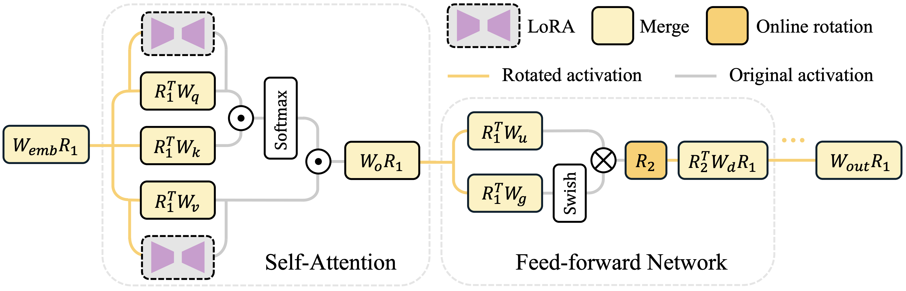

# 🔄 RoLoRA

<div align=center></div> 

This repository contains the code of RoLoRA introduced in our work: "[RoLoRA: Fine-tuning Rotated Outlier-free LLMs for Effective Weight-Activation Quantization](https://arxiv.org/abs/2407.08044)", published in EMNLP 2024. 

## 🌟 Abstract

In this work, we propose RoLoRA, the first LoRA-based scheme to apply rotation for outlier elimination, and then fine-tune rotated outlier-free LLMs for effective weight-activation quantization. RoLoRA can improve low-bit LoRA convergence and post-training quantization robustness in weight-activation quantization settings. RoLoRA is evaluated across various LLM series, tasks, and quantization settings, achieving up to 29.5% absolute accuracy gain of 4-bit weight-activation quantization of LLaMA2-13B on commonsense reasoning tasks compared to LoRA baseline. 

<div align=center>

</div>

## 🌿 Citation

If you find our code useful for your research, please consider citing:

    @article{huang2024rolora,
      title={RoLoRA: Fine-tuning Rotated Outlier-free LLMs for Effective Weight-Activation Quantization},
      author={Huang, Xijie and Liu, Zechun and Liu, Shih-Yang and Cheng, Kwang-Ting},
      journal={arXiv preprint arXiv:2407.08044},
      year={2024}
    }

## 🛠️ Getting Started

### Huggingface Hub Login

```bash
pip install --upgrade huggingface_hub
huggingface-cli login
```

### Installation

```bash
pip install -r requirements.txt
```
If you encounter any problems installing `fast_hadamard_transform` using pip, please consider building from [source](https://github.com/Dao-AILab/fast-hadamard-transform)

## 🚂 Finetuning 

For experiments applying RoLoRA on LLaMA2-7B, please run

```bash
sh rolora.sh
```

Remove `--rotate_down_proj` and `--rotate_mode 'hadamard'` for LoRA baseline without rotation. 

## ⌛ Merging

To merge RoLoRA adapter to LLaMA2-7B, please run

```bash
sh merge_rolora.sh
```

Specify `--adapter_name_or_path` and `--export_dir` to be path of adapter files and export target folder. Remove `--rotate_down_proj` and `--rotate_mode 'hadamard'` for merging LoRA adapter without rotation. 

## 🔍 Evaluation

For evaluation on Zero-shot CommonSense Reasoning (ZCSR) and MMLU benchmarks, please run

```bash
sh eval_rolora.sh
```

Specify `$NAME`, `$WBITS`, and `$ABITS` for the target quantization settings. Use `--w_rtn` for RTN quantization on weights (default is GPTQ). 
If you want evaluate the quantized models on more tasks, modify `--task` to any tasks that are included in [lm-evaluation-harness](https://github.com/EleutherAI/lm-evaluation-harness).

## 💾 Checkpoint

We provide the checkpoints for the RoLoRA-finetuned LLMs in the given huggingface repo. The evaluation logs are also included.

- [`ScarletAce/LLaMA2-7B-RoLoRA`](https://huggingface.co/ScarletAce/LLaMA2-7B-RoLoRA)
- [`ScarletAce/LLaMA2-13B-RoLoRA`](https://huggingface.co/ScarletAce/LLaMA2-13B-RoLoRA)
- [`ScarletAce/LLaMA3-8B-RoLoRA`](https://huggingface.co/ScarletAce/LLaMA3-8B-RoLoRA)

## 📚 Results

Below is the results in LLaMA2-7B, LLaMA2-13B, and LLaMA3-8B on zero-shot commonsense reasoning（ZCSR）and MMLU benchmarks.

| #Bits | Quantizer | Method          | LLaMA-2 7B  | LLaMA-2 7B | LLaMA-2 13B       | LLaMA-2 13B  | LLaMA-3 8B        | LLaMA-3 8B  |
|-------|-----------|-----------------|-------------------|---------------|---------------|-------------------|---------------|---------------|
|       |             |               |  ZCSR Avg.        | MMLU Avg.     | ZCSR Avg.         | MMLU Avg.     | ZCSR Avg.         | MMLU Avg.     |
| FP16  | -         | LoRA            | 68.4              | 43.5          | 70.5              | 52.4          | 70.0              | 62.7          |
| W4A4  | RTN       | LoRA            | 35.8              | 23.5          | 34.4              | 24.2          | 36.7              | 23.3          |
| W4A4  | RTN       | RoLoRA          | **54.1** (↑18.3)  | **25.8** (↑2.3)| **58.7** (↑24.3)  | **30.5** (↑6.3)| **50.0** (↑13.3)  | **32.1** (↑8.8)|
| W4A4  | GPTQ      | LoRA            | 37.0              | 23.5          | 34.4              | 24.4          | 36.6              | 23.9          |
| W4A4  | GPTQ     | RoLoRA           | **62.3** (↑25.3)  | **31.0** (↑7.5)| **63.9** (↑29.5)  | **38.9** (↑14.5)| **56.6** (↑20.0)  | **38.5** (↑14.6)|
| W6A6  | RTN       | LoRA            | 65.3              | 35.9          | 67.3              | 47.3          | 67.7              | 55.3          |
| W6A6  | RTN       | RoLoRA          | **66.8** (↑1.5)   | **40.5** (↑4.6)| **68.4** (↑1.1)   | **47.7** (↑0.4)| **67.8** (↑0.1)   | **59.4** (↑4.1)|
| W6A6  | GPTQ      | LoRA            | 65.5              | 35.7          | 68.0              | 47.6          | 67.8              | 54.3          |
| W6A6  | GPTQ      | RoLoRA          | **67.1** (↑1.6)   | **40.8** (↑5.1)| **68.8** (↑0.8)   | **47.9** (↑0.3)| **68.1** (↑0.3)   | **59.4** (↑5.1)|

## 💌 Acknowledgement

This repo benefits from [SpinQuant](https://github.com/facebookresearch/SpinQuant), [QuaRot](https://github.com/spcl/QuaRot), [LLaMa-Factory](https://github.com/hiyouga/LLaMA-Factory), and [fast-hadamard-transform](https://github.com/Dao-AILab/fast-hadamard-transform). Thanks for their wonderful works!

If you have any questions, feel free to contact Xijie Huang (xhuangbs AT connect.ust.hk, huangxijie1108 AT gmail.com)
